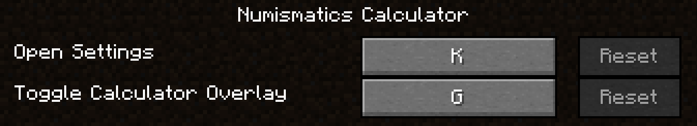
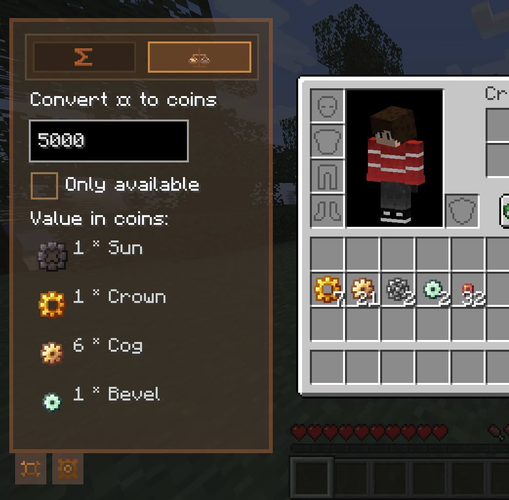
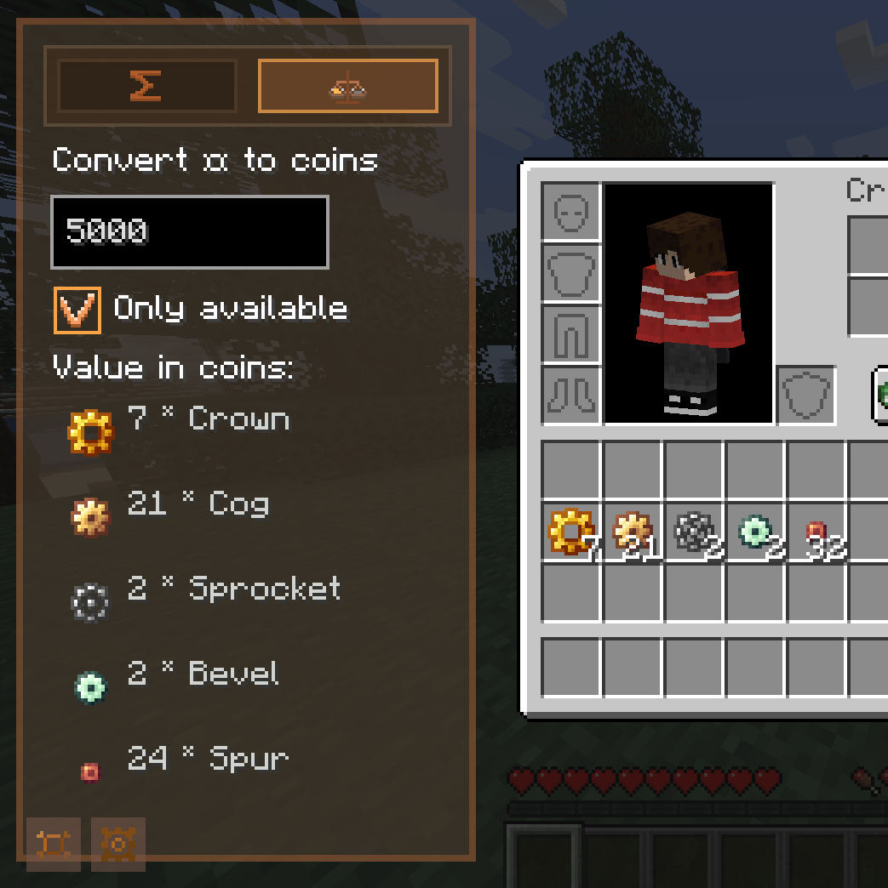

# Numismatics Calculator

# What This Does

This is a client-side forge mod that adds calculator functionality to coin items from the mod `"Create: Numismatics" by IThundxr`.  

This is useful because those coins have values like `1`, `8`, `16`, `64`, `512` and those are VERY hard to calculate for random sums like "75" if you have those coins as the main economy on an SMP and you trade everything for those.  

With the calculator you won't need to struggle with your system calculator, since this one is built into your game and has a lot of functionality specifically for this purpose.  

# Usage And Functionality

## Total Slot Value

By holding down `SHIFT` (can be configured) you can see the total value of every single slot with a coin.  

Remember, that you can check if you have the right sum available to pay someone with the `Selection` feature from the `Summation Tab` in the `Main Overlay`.  

## Control Panel

When opening your inventory, you'll see the mod's **Control Panel**.  

It lets you toggle the visibility of the **Main Overlay** and open mod's settings  

Both actions are available as keybindings too:

With those you can always toggle the `Main Overlay` with a key right from your inventory, even without the `Control Panel` visible.  

Additionally you can open the mod's `Config Screen` with a key too.  
  
The Main Overlay contains **TWO TABS** visible on the top.  

## Summation Tab

In the first tab you have a text displaying your total coins **in the inventory**, and coins in the selected area.  

You can toggle selection mode with the "Select button".  

It even **works in CHESTS** and all other containers:

## Conversion Tab

In the second tab you can enter an amount of `¤` to actual coins. By default, it'll tell you a general coin composition as if you had infinite coins.

Since the original mod has a coin type for `1 ¤`, there is never expected any sum in return.  

And there is a second mode accessible with the `Only available` checkbox:

This mode will only work with coins in your inventory and tell you if you don't have enough.

"Only Available" mode will take into account the cases when you **have to OVERPAY or you DON'T HAVE ENOUGH**:

## Mod Config Screen

By pressing the second button in your `Control Panel` or just by pressing a configured keybind, you can open the mod's `Config Screen`. Here you can toggle features on and off.  

# Notes

Current known bugs:

- None! :D

# Supported Versions

- Forge 1.20.1

# Building From Source Code

- Launch your installed [Intellij IDEA](https://www.jetbrains.com/idea/) (Community Edition will work just fine)  
- File -> New -> Project from Version Control -> paste `https://github.com/DaylightDragon/NumismaticsCalculator.git` in there, or just clone the repository in any other way  
- Select JDK 17, [Adoptium Temurin JDK](https://adoptium.net/temurin/releases?version=17&os=any&arch=any) recommended  
- Let `Gradle` load/sync the project's configuration. Or manually start it by finding the `Gradle` icon (elephant) on the right and pressing "Sync all Gradle projects" (2 arrows)  
- Make sure the bar on the bottom right disappeared after loading everything  
- In `Gradle` tasks run `forgegradle runs` -> `genIntellijRuns`.
- Now, **to build**, run task `build` -> `build` to compile the project into a jar in `/build/libs/<...>-all.jar`  
Or, to run in **dev environment**, find the `runClient` run configuration on top, select it and execute it with the run/debug button. Make sure you generated your IDE runs.  
